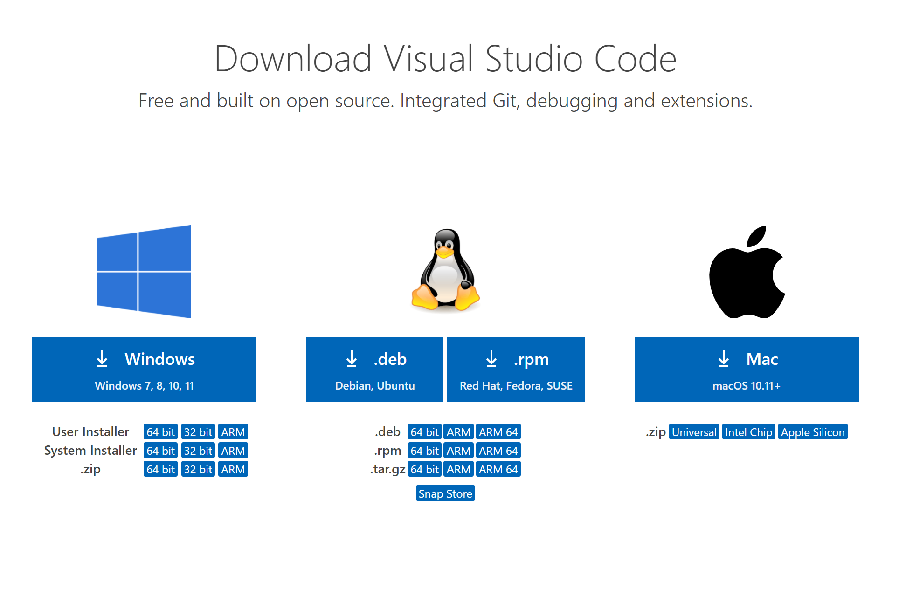
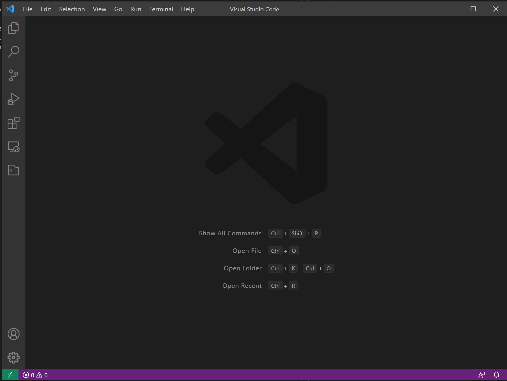
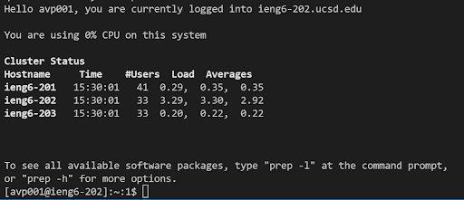
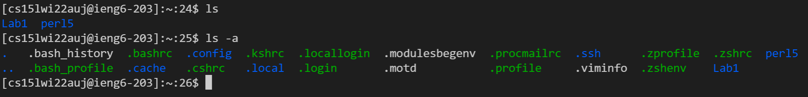
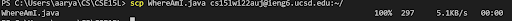
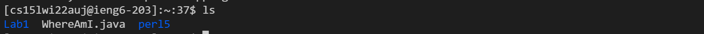
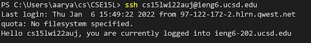
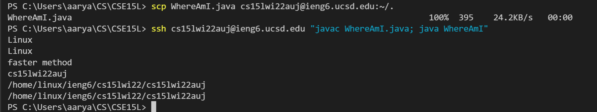

Hello and welcome to a quick tutorial on setting up remote access! 
## Installing VSCode

* To begin, visit the [VSCode Downloads](https://code.visualstudio.com/) page and select the version compatible with your system for installation
* Once complete, running the application should open a window similar to the one below:

## Remotely Connecting
* Visit https://sdacs.ucsd.edu/~icc/index.php to get your course-specific account
* If you're using Windows, you might need to install OpenSSH in order to use the `ssh` command ([Download OpenSSH](https://docs.microsoft.com/en-us/windows-server/administration/openssh/openssh_install_firstuse))
* Open a new terminal on VScode (**Ctrl/Command + '** ) and run `ssh ...@ieng6.ucsd.edu` replacing the "..." with your course-specific account ID 
* Finish connecting to the `ieng6` computer by typing in your password when prompted
  * **Note:** If it's your first time connecting to the server, the message `Are you sure you want to continue connecting (yes/no/[fingerprint])?` will appear; type `yes` to continue
* Once logged in, you should see a similar output on your terminal as the image below:

## Trying Some Commands
* Here are some important commands to try out in the terminal:
  * `ls` - lists all files within the current directory
  * `ls -a` - lists all files (including hidden ones) within the current directory
  * `cd` - opens specified directory
  * `cd ..` - changes current directory to the overhead one
  * `mkdir` - makes a new directory in the current one
  * `touch` - makes a new file in the current directory
* Running the ls functions would look like this:

## Moving Files with SCP
* Using the `scp` command, you can transfer files from your local computer to the server
  * For example `scp WhereAmI.java cs15lwi22auj@ieng6.ucsd.edu:~/.` will move the WhereAmI.java file to my home directory in the server
  * **Note:** The part directly after `scp` references the file path (make sure you are in the correct directory) and the `~/.` is the destination path

* You can login to ieng6 with `ssh` and use to `ls` to see the transferred file

## Setting an SSH Key
* In order to avoid being prompted for your password each time for an `scp` or `ssh` command, run `ssh-keygen`
  * Enter in `/Users/name/.ssh/id_rsa` replacing 'name' with your account user when asked for a save path
* Finish setup with the following commands: `ssh <ieng6 account>`, `mkdir .ssh`, `logout`, and `scp /Users/name/.ssh/id_rsa.pub <ieng6 account>:~/.ssh/authorized_keys` 
* You should now be able to `ssh`/`scp` without a password like so:

## Optimizing Remote Running
* To work faster while connecting remotely, you can add commands in quotes at the end of your ssh command to run them directly on the server after using `scp` to transfer your local edits

* **Note**: While this process only saves 5 keystrokes (116 v. 121), there is about 7 seconds saved in each run. This could easily amount to more than 10 minutes when considering how many times a file would be ran for testing while working on a lab.