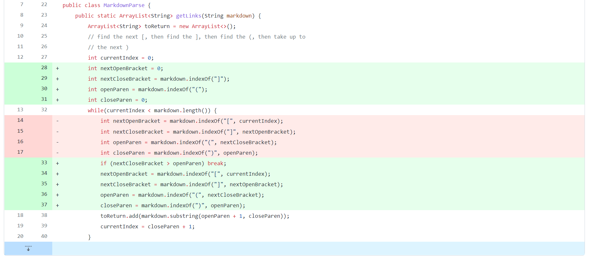
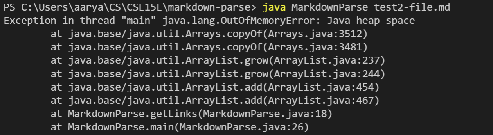
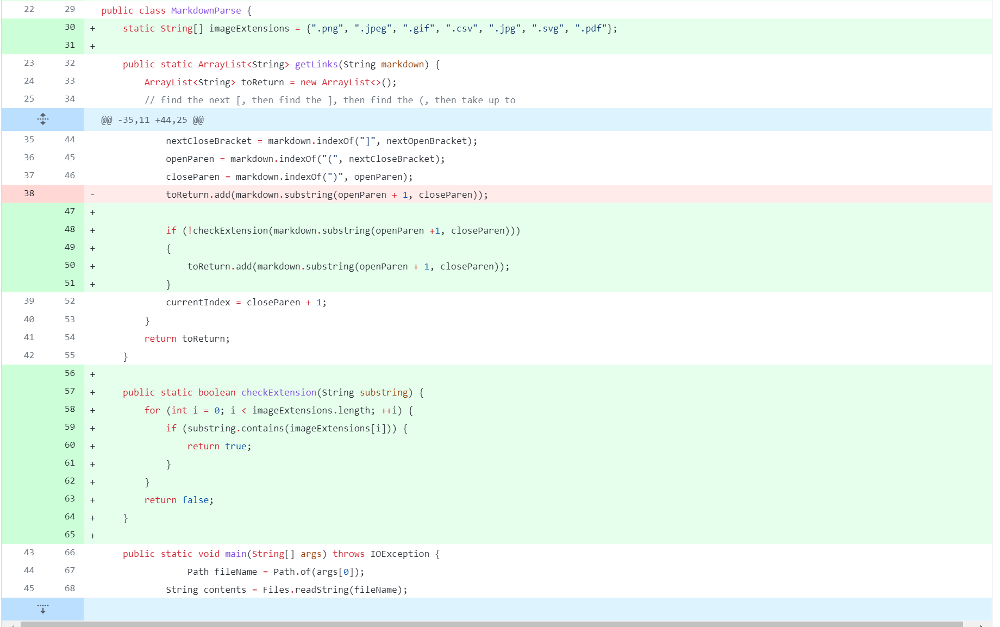
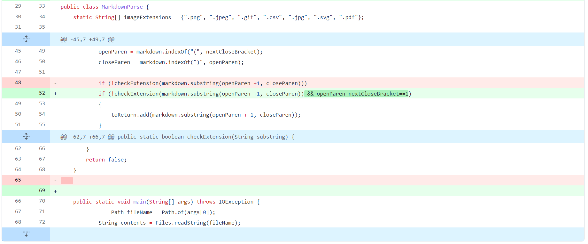

# Code Change One

**File:** [Test 2](test2-file.md)
## Failing Output

* The error was blah blah.

# Code Change Two

**File:** [Test 2](test3-file.md)
## Failing Output

* The error was blah blah here too.

# Code Change Three

**File:** [Test 2](test4-file.md)
## Failing Output

* The error was blah blah here too.