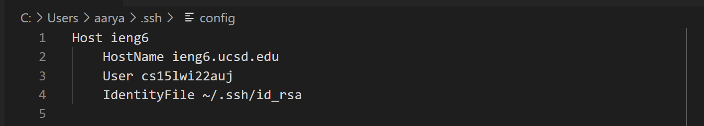
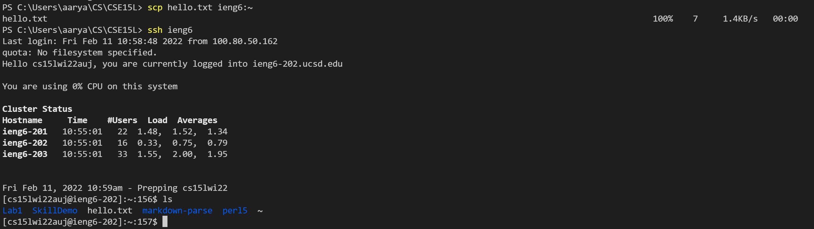

# Streamlining ssh Configuration

* Config file should now be set up to look like above. The first line has the server nickname with each subsequent line detailing the server's hostname, your username, and the path of the id_rsa file.

* If set up correctly, `ssh ieng6` is all that is needed to login and connect with the remote server. 

* In order to use `scp`, the path with the user and hostname in the original is simply
replaced with the new nickname given to the server. In total, for all steps `ieng6` simply replaces
`cse15lwi22auj@ieng6.ucsd.edu`.
