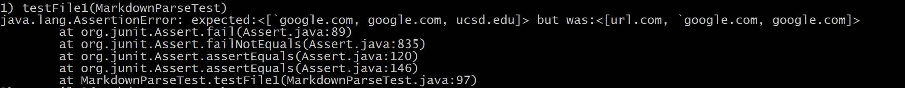
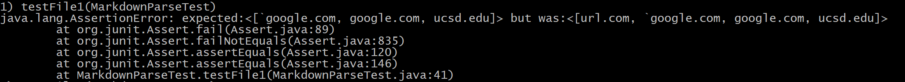
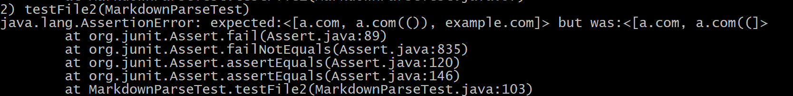
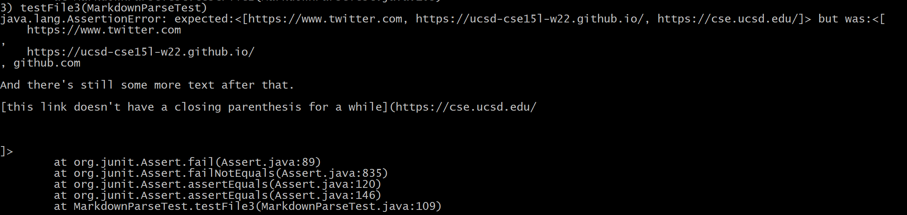
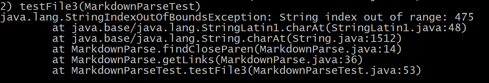

My repository: [markdown-parse repository](https://github.com/aaryapatel100/markdown-parse).

Reviewed repository: [markdown-parse repository](https://github.com/ucsd-cse15l-w22/markdown-parse).

# Test Case 1
```
@Test
    public void testFile1() throws IOException {
        String contents= Files.readString(Path.of("./lab8test1.md"));
        List<String> expect = List.of("`google.com", "google.com", "ucsd.edu");
        assertEquals(expect, MarkdownParse.getLinks(contents));
    }
```
## My Output

## Reviewed Code Output


# Test Case 2
```
@Test
    public void testFile2() throws IOException {
        String contents= Files.readString(Path.of("./lab8test2.md"));
        List<String> expect = List.of("a.com", "a.com(())", "example.com");
        assertEquals(expect, MarkdownParse.getLinks(contents));
    }
```
## My Output

## Reviewed Code Output

* It passed the test case!

# Test Case 3
```
@Test
    public void testFile3() throws IOException {
        String contents= Files.readString(Path.of("./lab8test3.md"));
        List<String> expect = List.of("https://www.twitter.com", "https://ucsd-cse15l-w22.github.io/", "https://cse.ucsd.edu/");
        assertEquals(expect, MarkdownParse.getLinks(contents));
    }
```
## My Output

## Reviewed Code Output


# Code Changes
* For test case 1, the bug fix for checking backticks would be a small fix
as backticks don't have different open or close symbols so I could simply use a
counter to see which backtick is an open/close (check if the backtick is an odd
or even place using modulus) and store pairs of open/close backtick indices. 
That way when the parentheses are being checked, if any exists between a pair, I
would simply ignore that during my link check.

* Test case 2 would have a more involved change as it would involve using stacks
to get the outermost indices for each of the three: brackets, parentheses, and
escaped brackets. Even then there could be multiple cases of nested parentheses
inside of the other nested type that could create bugs probably making this fix
a more complex one.

* Test case 3 would have a small code change as it would just be a matter of
trimming all white space between brackets and parentheses when getting links.